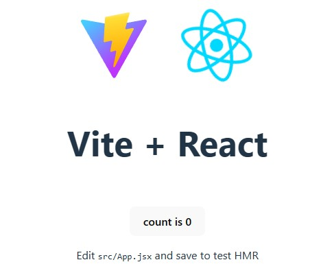
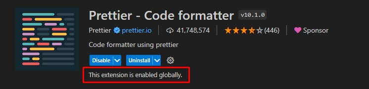
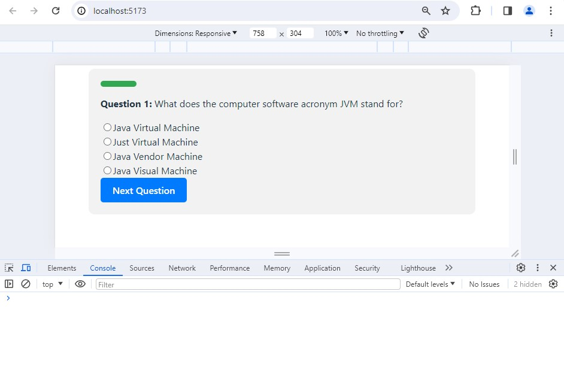

# Quiz made with React.

## Description:
The Quiz App is a React application that allows users to take a quiz consisting of multiple-choice questions fetched from an API. It features dynamic question rendering, user answer selection, progress tracking, and displays quiz results upon completion. The app utilizes styled components for styling, error handling for fetching questions, and context API for state management.

### Quiz Application Usage Instructions:

1. **Starting the Quiz:**
   - Upon opening the Quiz Application in your web browser, you will be presented with the firs quiz question.
   
2. **Answering Questions:**
   - Once the quiz starts, each question will be displayed one by one.
   - Read the question carefully and select your answer by clicking on the radio button next to the option you choose.
   - After selecting your answer, click the "Next Question" button to move on to the next question.
   - You can only select one answer per question.

3. **Viewing Results:**
   - After answering all the questions, you will be presented to the results.
   - On the results page, you can see the total number of correct answers and a breakdown of each question along with your selected answer and the correct answer.
   - Correct answers are highlighted in green, and incorrect answers are highlighted in red.

4. **Restarting the Quiz:**
   - If you wish to retake the quiz, simply click on the "Restart Quiz" button at the bottom of the results page.
   - This will reset the quiz, allowing you to start again from the beginning.

5. **Navigation:**
   - You go only go to the next question using the "Next Question" button.
   - Once you reach the end of the quiz, you will automatically be redirected to the results page.

6. **Progress Bar:**
   - Throughout the quiz, a progress bar will indicate your progress relative to the total number of questions.
   - The progress bar visually represents how far along you are in completing the quiz.

7. **Error Handling:**
   - If there are any errors encountered during the quiz, such as difficulty in fetching questions or unexpected errors, appropriate error messages will be displayed to alert you.

Enjoy taking the quiz and testing your knowledge! If you encounter any issues or have feedback, feel free to reach out for assistance.

# Developing
## Getting started

* Created repo on GitHub: https://github.com/RobertAhlin/react-quiz
* Cloned and opened with VS Code.
* App created with Vite: `npm init vite@latest . -- --template react`
* Ran `npm install`
* App started with: `npm run dev`  

* Selected Axios for my API handling. Installed with `npm install axios`

# API
Using the [Open Trivia Database API](https://opentdb.com/).  
Documentation is found [here](https://opentdb.com/api_config.php).

The API file, `api.jsx`, contains a function named `fetchQuizQuestions` responsible for fetching quiz questions from an external API.

**fetchQuizQuestions Function:**
- This function is an asynchronous function, indicating that it performs an asynchronous operation, such as making an HTTP request.
- It utilizes the `axios` library to perform the HTTP GET request to the specified API endpoint.
- The API endpoint used is `'https://opentdb.com/api.php'`, which is the Open Trivia Database API.
- Query parameters are appended to the URL to specify the number of questions (`amount`), category (`category`), difficulty (`difficulty`), type of questions (`type`), and encoding (`encode`). In this case, it requests 10 questions of easy difficulty from the category with ID 18 (Computers) and the type of multiple-choice questions.
- Upon successful retrieval of data from the API, it checks if the response data contains an array of quiz questions (`data.results`).
- If the data format is valid (i.e., it contains an array of questions), it formats each question by combining the incorrect answers with the correct answer into an `answers` array.
- The formatted questions are returned as an array of objects, where each object represents a single quiz question with its associated answers.
- If there's an error during the API request or the data format is invalid, it throws an error with an appropriate message.

# Dependencies:
- React
- Axios
- PropTypes
- Styled-components

Make sure you have Node.js and npm (Node Package Manager) installed on your machine before proceeding with the installation steps below.

# Components

1. **ErrorComponent**:
   - Renders an error message when an error occurs during the quiz.

2. **LoadingComponent**:
   - Renders a loading spinner while fetching quiz questions or performing other asynchronous tasks.

3. **NextButtonComponent**:
   - Renders a button to move to the next question in the quiz.

4. **ProgressBarComponent**:
   - Renders a progress bar to visualize the progress of the quiz.

5. **QuestionComponent**:
   - Renders a single question along with its options (answers) for the user to select.

6. **QuizComponent**:
   - Manages the state of the quiz, including fetching questions, handling user answers, and determining the quiz's completion.

7. **QuizResultComponent**:
   - Renders the result of the quiz, including the total number of correct answers and the user's selected answers compared to the correct ones.

8. **RestartButtonComponent**:
   - Renders a button to restart the quiz from the beginning.

# Check project assessment criteria

## For G (Passing Requirements):
- [x] **React Setup:**  
It is set up with a React project using `create-react-app`.
- [x] **Function Components:**  
Project includes at least 5 function components 
    1. ErrorComponent
    2. LoadingComponent
    3. NextButtonComponent
    4. ProgressBarComponent
    5. QuestionComponent
    6. QuizComponent
    7. QuizResultComponent
    8. RestartButtonComponent

- [x] **API Data Fetching:**  
Data is fetched from an external API using Axios in the `fetchQuizQuestions` function in `api.jsx`.

- [x] **CSS-in-JS Styling:**  
Components are styled using "css-in-js" approach with Styled Components.
    1. **LoadingComponent.jsx**: Defines a loading spinner with styles using styled-components.
    2. **NextButtonComponent.jsx**: Styles the next button with styled-components.
    3. **ProgressBarComponent.jsx**: Styles the progress bar with styled-components.
    4. **QuizArea** in **QuizComponent.jsx**: Wraps the quiz area and applies styling using styled-components.
    5. **QuizResultContainer**, **QuestionContainer**, **CorrectAnswer**, and **IncorrectAnswer** in **QuizResultComponent.jsx**: Styled components used to format the quiz result display.

- [x] **Hooks Usage:**  
The Quiz uses `useReducer`and `useContext`:
    1. useReducer:
    In the QuizProvider component within QuizContext.jsx, useReducer is used to manage the state and dispatch actions.  
    2. useContext:
    In the useQuizState and useQuizDispatch custom hooks within QuizContext.jsx, useContext is used to access the state and dispatch functions from the context provider.

## For VG (Additional Requirements for Higher Grade):
- [x] **Component Count:**
See function component section.  
Additionally, the App component in App.jsx is also a component, but it serves as the entry point of the application and does not render any UI components directly.
- [x] **Code Formatting:**
The code formatting is consistent, Prettier extension is installed in VS Code.

The application start without any errors in the console:

# Installation and Setup:
1. Clone the Repository:  
`git clone https://github.com/RobertAhlin/react-quiz.git`

2. Navigate to the Project Directory:  
Make sure you are in the root folder `react-quiz`

3. Install Dependencies:  
`npm install`  
This will install all the necessary dependencies required for the project to run.

4. Start the Development Server:  
`npm start`  
This will start the development server and open the Quiz App in your default web browser.

5. Access the Application:  
Once the development server is started, you can access the Quiz App in your web browser. (E.g. http://localhost:3000 )

